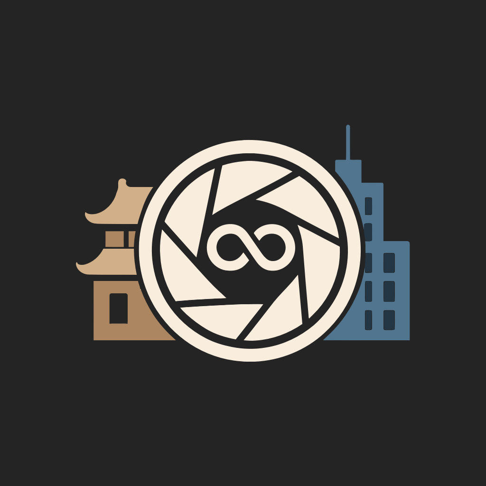
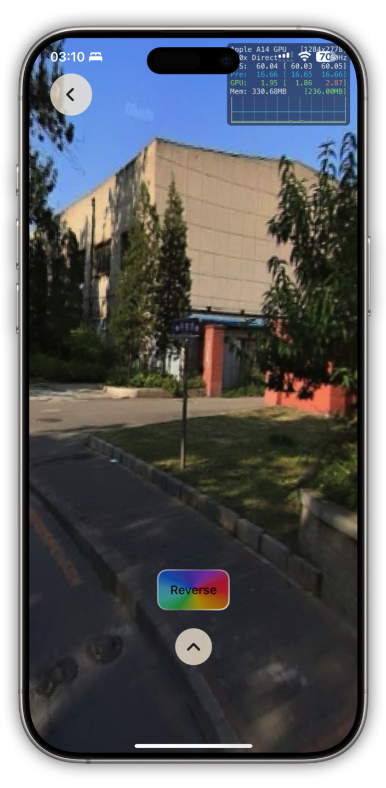
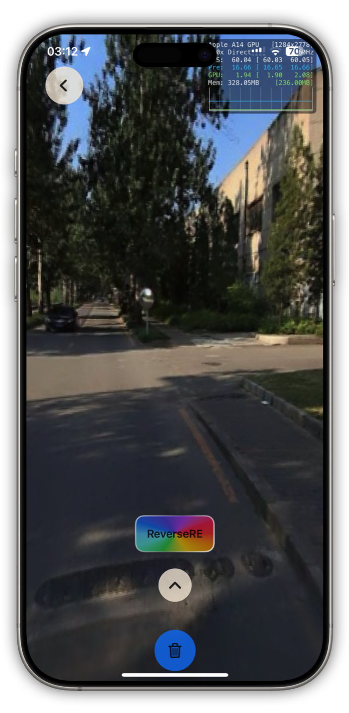
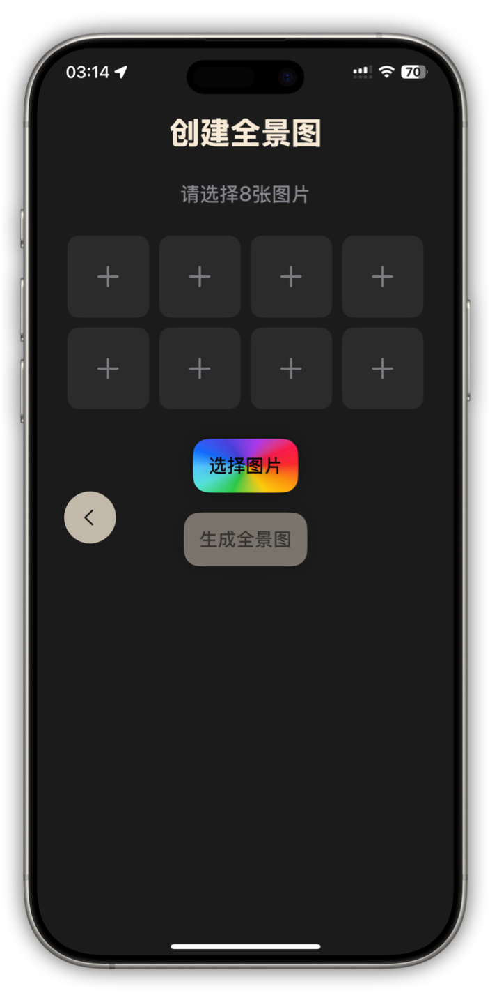

# Reverse（回溯）项目介绍说明

## iOS介绍
对于没有Vision Pro设备的用户，我们贴心的准备了iOS软件，可以同样感受全景的乐趣。

## 主页
点击Reverse软件，即可打开App进入主页。

## 功能
主页功能模块主要由三部分组成：1. 四个预设景点 2. 选点跃迁 3. 创建全景图

### 1. 预设景点
软件提供了四个预设的景点，可以用现有的全景内容沉浸式旅游，并且体验不同年份的时代变迁。

#### 不同年份的全景图
选择一个地点点击进入后即可选择该地点的不同年份的全景图观看。

#### AI生成的不同年份的时光穿梭视频
点击闪烁的按钮“Reserve”即可感受由AI带来的“时光穿梭”，回溯这几年的变化。

### 2. 选点跃迁
选点跃迁提供了用户自主选择道路街景的功能，并且可以自主生成时光穿梭视频。

#### 获取道路的多年份全景图
点击“选点跃迁”按钮后可以进入软件内置的地图，通过滑动屏幕就可以游览地图，点击某一点就可以选中道路位置，再点击下方跃迁按钮就可以开始跃迁。

（注意：部分道路可能没有街景图，尝试跃迁会失败）

成功跃迁后就可以查看这个地点的若干个年份时期的全景图。

在退出再回来后，可以点击回到之前的位置来回顾上次自己的跃迁点。

#### 生成该全景图的时光穿梭视频
在游览全景图时，用户可以点击Reverse按钮开始生成自己的时光穿梭视频。

由于是临时生成，需要1-2分钟的生成时间，还请耐心等待。

成功生成后，就可以游览全景模式的全景视频。

点击垃圾桶标志后就可以重置生成时光穿梭图。

### 3. 生成自己的全景图
在点击“创建全景图”按钮后，就可以进入创造全景图页面。

可以通过8张内容相互重叠关联的图片，可以生成全景图并预览。

## Vision Pro介绍

## 功能

### 1. 预设景点

#### 不同年份的全景图

#### AI生成的不同年份的时光穿梭视频

### 2. 选点跃迁

#### 获取道路的多年份全景图

#### 生成该全景图的时光穿梭视频

### 3. 生成自己的全景图