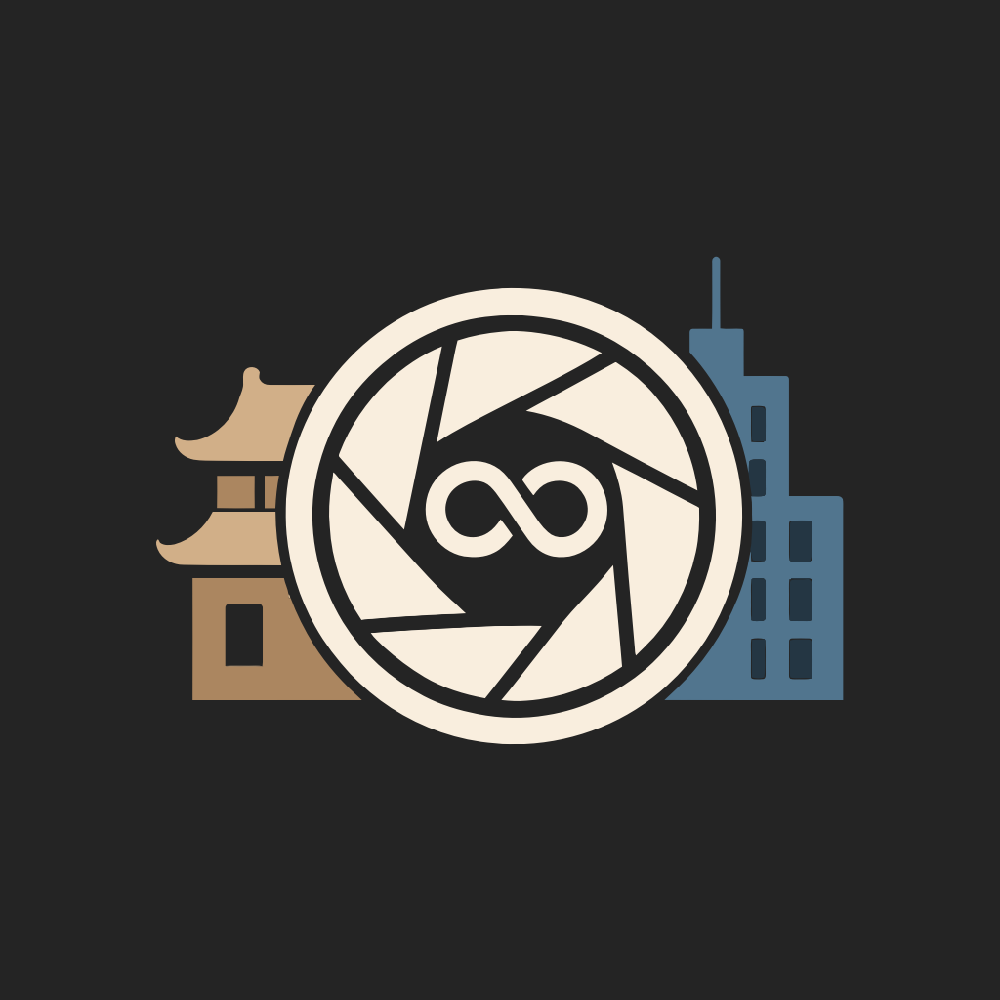

# Reverse 回溯
## 用Vision回望世界，让时间重现街角，利用全景技术，探寻城市变迁。

## 项目简介
本项目旨在使用8张内容相互交错的图片生成360度全景图，并且通过本项目软件的iOS端和Vision Pro端展示，借助百度街景的图片数据，本项目实现了用户指定街道位置并生成与之对应的若干年份的全景图，并且支持使用AI结合若干年份的全景图实现“时光回溯”效果，沉浸式体验当前位置这些年来的变迁。

## 介绍说明

### iOS介绍
对于没有Vision Pro设备的用户，我们贴心的准备了iOS软件，可以同样感受全景的乐趣。

### 主页
点击Reverse软件，即可打开App进入主页。

### 功能
主页功能模块主要由三部分组成：1. 四个预设景点 2. 选点跃迁 3. 创建全景图

#### 1. 预设景点
软件提供了四个预设的景点，可以用现有的全景内容沉浸式旅游，并且体验不同年份的时代变迁。

##### 不同年份的全景图
选择一个地点点击进入后即可选择该地点的不同年份的全景图观看。

##### AI生成的不同年份的时光穿梭视频
点击闪烁的按钮“Reserve”即可感受由AI带来的“时光穿梭”，回溯这几年的变化。

#### 2. 选点跃迁
选点跃迁提供了用户自主选择道路街景的功能，并且可以自主生成时光穿梭视频。

##### 获取道路的多年份全景图
点击“选点跃迁”按钮后可以进入软件内置的地图，通过滑动屏幕就可以游览地图，点击某一点就可以选中道路位置，再点击下方跃迁按钮就可以开始跃迁。

（注意：部分道路可能没有街景图，尝试跃迁会失败）

成功跃迁后就可以查看这个地点的若干个年份时期的全景图。

在退出再回来后，可以点击回到之前的位置来回顾上次自己的跃迁点。

##### 生成该全景图的时光穿梭视频
在游览全景图时，用户可以点击Reverse按钮开始生成自己的时光穿梭视频。

由于是临时生成，需要1-2分钟的生成时间，还请耐心等待。

成功生成后，就可以游览全景模式的全景视频。

点击垃圾桶标志后就可以重置生成时光穿梭图。

#### 3. 生成自己的全景图
在点击“创建全景图”按钮后，就可以进入创造全景图页面。

可以通过8张内容相互重叠关联的图片，可以生成全景图并预览。

就像这样，在湖畔中心的亭子旁生成的全景图，部分效果如下：

### Vision Pro 介绍
在 **Apple Vision Pro** 上，Reverse App 带来的是一种真正的 **空间计算** 体验。戴上 Vision Pro，用户仿佛置身于真实世界的全景影像中，四周的景色环绕眼前，真正实现“走进画面里”的感觉。

Reverse 在 Vision Pro 上充分利用了 **眼动追踪**、**空间音效** 和 **沉浸式渲染** 技术，让用户不仅能看见风景，还能 **感受到时间的流动**。

安装完成后，在 Vision Pro 主界面即可找到 Reverse 应用图标，注视并轻点即可进入。

---

### 功能
Vision Pro 版本提供了 **三大核心功能模块**，在虚拟空间中通过 **注视（眼睛控制）+ 点击（手势操作）** 就能轻松探索：

#### 1. 预设景点
Reverse 精选了四个世界各地的经典景点，在 Vision Pro 上以全景方式呈现，用户仿佛穿越到现场。

- **不同年份的全景图**  
  进入某个景点后，可以选择该地点 **不同时期的全景图像**，例如 2015 年与 2023 年的街景差异，清晰看到岁月在建筑和环境上的痕迹。

- **AI 生成的时光穿梭视频**  
  注视并点击 “Reverse” 按钮，即可触发 AI 自动生成 **时光穿梭视频**，场景会在眼前动态切换，让用户 **沉浸式感受时间的流逝**。

#### 2. 选点跃迁
这一功能让用户可以在 Vision Pro 中 **自由探索地图**，并“跃迁”到任何支持的地点。

- **获取道路的多年份全景图**  
  通过注视地图选择目标点，再轻点确认，系统将带你“瞬移”到这个位置。若该处有多年度街景数据，你可以一次性看到它们的变化（无数据时系统会提示）。

- **生成时光穿梭视频**  
  在查看全景时，点击 Reverse 按钮即可让 AI **即时生成**该位置的时光穿梭视频。等待片刻，四周画面就会像 **时间隧道** 一样切换。

#### 3. 生成自己的全景图
Vision Pro 版本同样支持 **用户自制全景图**。  
上传 8 张重叠拍摄的照片后，系统会自动拼接生成一张高质量全景图，并以 Vision Pro 的空间显示技术呈现出来。

生成完成后，你可以 **走进自己拍摄的场景**，感受“置身画中”的奇妙体验，这也是 Vision Pro 带来的独特沉浸感。

---

### Vision Pro 特色体验
- **沉浸式全景**：全景图将完整环绕在视野四周，没有屏幕边界感。
- **空间交互**：用眼睛注视、用手势点击，比手机操作更加直觉自然。
- **时光穿梭临场感**：AI 生成的视频在 Vision Pro 上看起来就像真的“时间流动”，画面转换充满层次感。
- **用户原创空间**：拍摄并生成的全景图能直接在虚拟世界中走进，感受“自己创造的世界”。

---